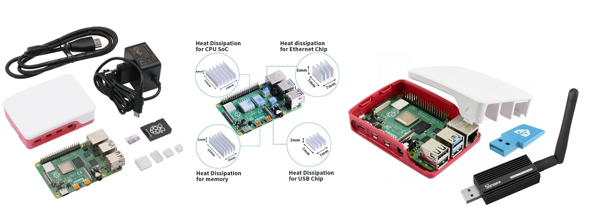

# Système de supervision sonore

## Prérequis

Un accès internet est indispensable pour installer et configurer le contrôleur. Une fois configuré, cette connexion n'est plus nécessaire. Cependant, la cantine doit disposer d'un réseau WiFi pour le fonctionnement des capteurs.

## Configuration du contrôleur

Le contrôleur fonctionne à l'aide de Home Assistant, un système de domotique Open Source. C'est lui qui va centraliser les contrôles audio et lumineux en fonction des mesures remontées par les capteurs sonores et des règles que nous appliquerons.

Pour plus d'informations sur Home Assistant, consultez le site <https://www.home-assistant.io/>

Le Raspberry Pi 4B a été choisi car il possède une sortie audio Jack 3.5, permettant à Home Assistant de diffuser des messages audio ou de la musique. Les systèmes Home Assistant Green et Raspberry Pi 5 ne disposent pas de cette sortie audio.

## Assemblage du contrôleur

L'assemblage du Raspberry Pi 4B est très simple. Une fois réalisé, connectez-y les 2 modules USB pour gérer les protocoles Zigbee et Matter.

## Installation du contrôleur

La documentation officielle d'installation de Home Assistant sur Raspberry Pi 4B est très bien rédigée et maintenue à jour par la communauté. Nous vous orientons vers cette page pour cette première étape :
<https://www.home-assistant.io/installation/raspberrypi>

Après le démarrage, plusieurs modules complémentaires doivent être installés manuellement.

### Modules complémentaires à installer :

    Paramètres => Modules complémentaires

- Zigbee
- Media Player Daemon
- ESPHome Device Builder

## Appairage des composants

Le contrôleur est maintenant prêt pour appairer les bandeaux LED, configurer les capteurs sonores et mettre en place le module audio.

### Bandeaux LED

    Paramètres => Zigbee => Ajouter un appareil

Il faut appairer les "4 contrôleurs Zigbee" afin de permettre à Home Assistant de piloter le bandeau LED.

### Capteurs Sonores

    Paramètres => Appareils et services

Les capteurs devraient être détectés automatiquement par Home Assistant s'ils parviennent à se connecter au réseau WiFi. Ils apparaîtront dans la section "Découvertes", il suffira alors de cliquer sur "Ajouter".

### Messages Audio

    Médias => My media => mdp => media

Vous pouvez à présent placer les fichiers audio dans le répertoire du module MDP pour que Home Assistant les diffuse.

## Création de templates

    Paramètres => Appareils et services => Entrées

Il faut créer 6 templates :

- Système

  - Type : Texte
  - Nom : Système

Ce template servira aux automatisations de démarrage de Home Assistant afin  de s'assurer que tout fonctionne correctement.

- Seuil Sonore Bas

  - Type : Nombre
  - Nom : Seuil Sonore Bas
  - Valeur minimum : 80
  - Valeur maximum : 100

- Seuil Sonore Haut

  - Type : Nombre
  - Nom : Seuil Sonore Haut
  - Valeur minimum : 85
  - Valeur maximum : 105

Ces deux templates permettent de modifier les seuils de déclenchement à un seul endroit.

- Bandeau LED

  - Type : Groupe → Groupe de lumières
  - Nom : Bandeau LED
  - Membres : Ajouter toutes les LED

Ce template permet de gérer tous les bandeaux LED en même temps.

- Couleur Bandeau LED

  - Type : Template → Capteur
  - Nom : Couleur Bandeau LED
  - Etat : contenu de [Template LED](https://github.com/RG-LRJ/Systeme-de-supervision-sonore/blob/main/templates/CouleurLed.yaml)
  - Remplacer les **entity_id** avec ceux de votre système.

Ce template sert à vérifier en langage naturel la couleur du bandeau LED dans les automatisations.

- Niveau Sonore Global

  - Type : Template → Capteur
  - Nom : Niveau Sonore Global
  - Etat : contenu de [Template Capteur](https://github.com/RG-LRJ/Systeme-de-supervision-sonore/blob/main/templates/CapteurGlobal.yaml)
  - Remplacer les **entity_id** avec ceux de votre système.

Pour un fonctionnement optimal du système, il faut calculer la moyenne des niveaux sonores des capteurs pour obtenir un niveau global de la pièce. De plus, il est essentiel de gérer les possibles déconnexions d'un capteur. Pour cela, un template nommé Capteur Sonore Global servira de référence pour déclencher les automatisations en fonction du niveau sonore mesuré.

Dans la cantine de La Roche-Jaudy, ce template global calcule le niveau sonore moyen en utilisant les 3 valeurs les plus élevées parmi les 4 capteurs du système. Pour garantir la fiabilité, le capteur ignore toute valeur n'ayant pas été mise à jour depuis plus de 7 secondes. Le template gère aussi les défaillances de capteurs : la moyenne est recalculée uniquement avec les capteurs en ligne. Si un seul capteur reste actif, le système continue de fonctionner avec celui-ci. Enfin, si tous les capteurs sont hors ligne, le bandeau LED passe au bleu pour signaler une anomalie.

## Création des scripts automatiques

    Paramètres => Automatisations et scènes

### Test du système

Pour vérifier que le système a bien démarré, il faut tester les capteurs et les haut-parleurs. Pour cela, créez 3 automatisations.

- Démarrage Home Assistant

  - [demarrage_ha.yaml](https://github.com/RG-LRJ/Systeme-de-supervision-sonore/blob/main/automatisations/demarrage_ha.yaml)
  - Remplacer les **entity_id** avec ceux de votre système.

- Test du système

  - [test_systeme.yaml](https://github.com/RG-LRJ/Systeme-de-supervision-sonore/blob/main/automatisations/test_systeme.yaml)
  - Remplacer les **entity_id** avec ceux de votre système.

- Redémarrage Home Assistant si le système n'est pas OK

  - [redemarrage_ha.yaml](https://github.com/RG-LRJ/Systeme-de-supervision-sonore/blob/main/automatisations/redemarrage_ha.yaml)
  - Remplacer les **entity_id** avec ceux de votre système.

### Supervision Sonore

Voici maintenant les 4 automatisations pour interpréter le niveau sonore global.

- Vert

  - [1_vert.yaml](https://github.com/RG-LRJ/Systeme-de-supervision-sonore/blob/main/automatisations/1_vert.yaml)
  - Remplacer les **entity_id** avec ceux de votre système.

- Orange

  - [2_orange.yaml](https://github.com/RG-LRJ/Systeme-de-supervision-sonore/blob/main/automatisations/2_orange.yaml)
  - Remplacer les **entity_id** avec ceux de votre système.

- Orange 15s

  - [3_orange_15s.yaml](https://github.com/RG-LRJ/Systeme-de-supervision-sonore/blob/main/automatisations/3_orange_15s.yaml)
  - Remplacer les **entity_id** avec ceux de votre système.

- Rouge

  - [4_rouge.yaml](https://github.com/RG-LRJ/Systeme-de-supervision-sonore/blob/main/automatisations/4_rouge.yaml)
  - Remplacer les **entity_id** avec ceux de votre système.

## Démarrage

Le système prend environ 4 minutes pour démarrer complètement, se tester et être opérationnel. 

Le système de supervision sonore est maintenant prêt et opérationnel !👍